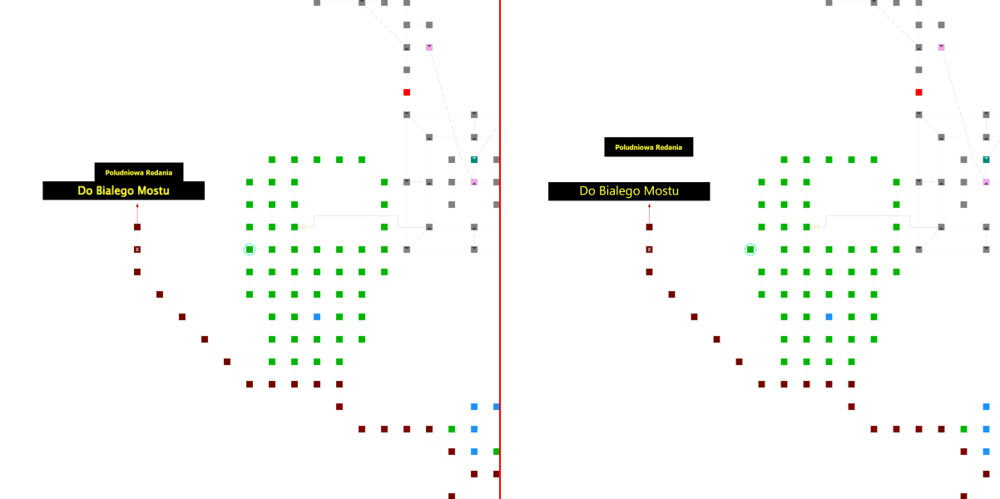
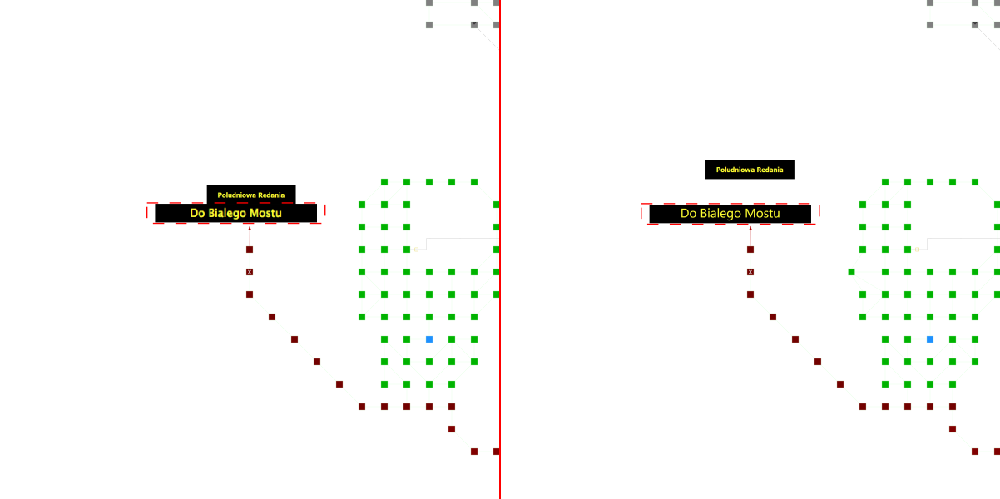

# mudlet-map-diff

Compare two Mudlet map files and generate a structural diff and visual SVG representations of changes.

## Usage

### CLI

You can use the CLI to quickly compare two maps and generate SVG diffs and an interactive HTML report:

```bash
npx mudlet-map-diff old-map.dat new-map.dat --output diff-folder --html
```

Options:
- `-o, --output <dir>`: Directory to save the diffs (default: `diff`)
- `--html`: Generate an interactive HTML report
- `--no-svg`: Do not generate individual SVG files
- `-V, --version`: Output the version number
- `-h, --help`: Display help

### Library

```typescript
import { createDiff } from "mudlet-map-diff";

// Returns a structural diff and optionally generates SVG files in the output directory
const diff = await createDiff("maps/v1.dat", "maps/v2.dat", "diff-output");

console.log("Rooms added:", diff.rooms.added.length);
console.log("Rooms updated:", Object.keys(diff.rooms.updated).length);
```

## Visual Examples

When a change is detected, an SVG is generated showing the old state (left) and new state (right) with the changed element highlighted.

| Room Change | Label Change |
| :---: | :---: |
|  |  |

## Diff Model

The `createDiff` function returns a `MapDiff` object with the following structure:

- `rooms`: `EntityDiff<MudletRoom>`
- `labels`: `EntityDiff<MudletLabel>`
- `areas`: `EntityDiff<MudletArea>`
- `map`: `PropertyDiff` (top-level map properties)

Each `EntityDiff` contains:
- `added`: Array of entities present in the new map but not the old one.
- `deleted`: Array of entities present in the old map but not the new one.
- `updated`: A record of property changes for entities present in both maps.

A `PropertyDiff` is a record where keys are property paths (e.g., `"name"`, `"pos.0"`) and values are `{ from: any, to: any }`.